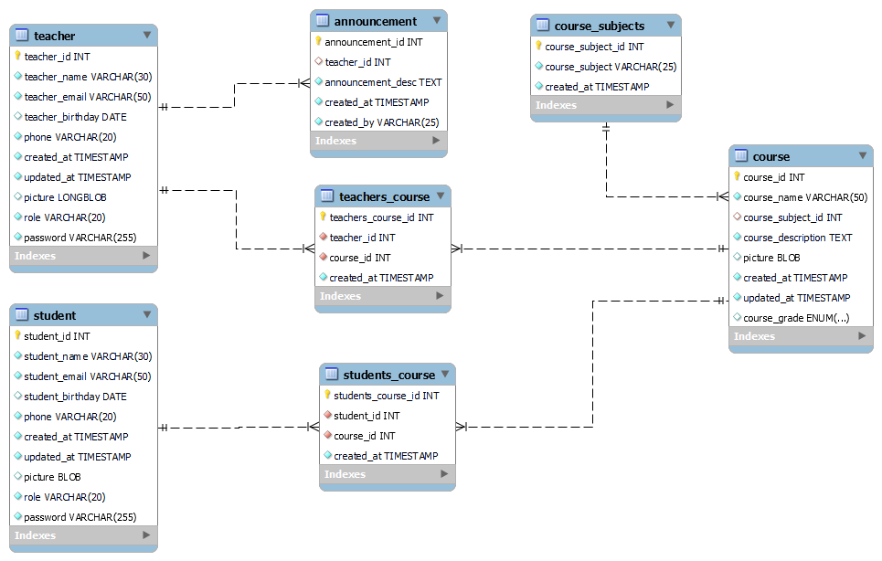
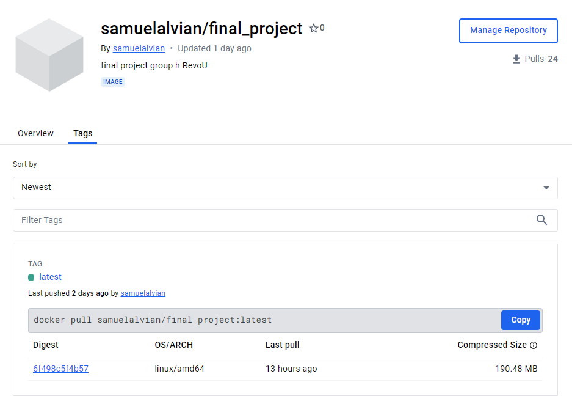
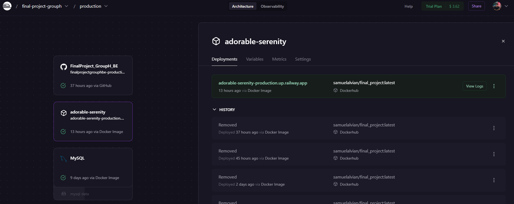
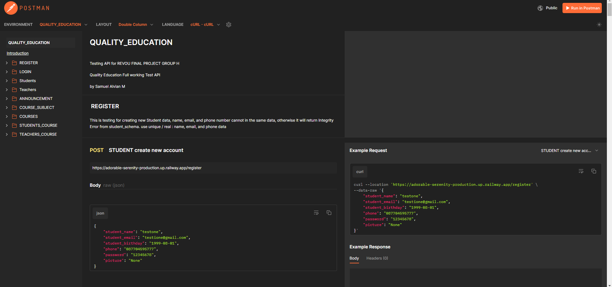
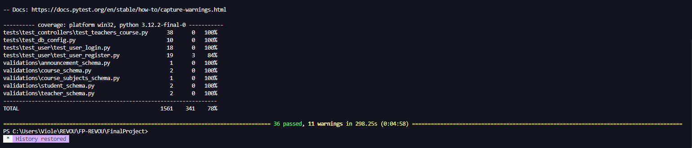

# REVOU FINAL PROJECT GROUP H 
# BACKEND-PROJECT

created by : Samuel Alvian Mahardika


## Folder Structure

This is some of my VSC folder structure: 

 - **FINALPROJECT/**
    - **.venv/**
    - **assets/**
    - **connectors/** # make connection to app.py and database, creating API
        - **mysql_connector.py**
    - **controllers/** # all query logics main code
    - **decorators/** # my role checker logic
    - **migrations/** 
    - **models/** # my Base model and relationship between tables from database
    - **tests/** # testing query code logic, role checker, and login required (jwt token).
    - **validations/** # Schema to creating new data and UPDATE data. 
- **.env** # pass code to access database and hosting.
- **app.py** # all connected routes and load user placed here
- **requirements.py** #all dependencies I use stored here
- **Dockerfile** #code to docker deployment needs


### 1. Github Project BACKEND Link: [Github-Backend](https://github.com/irfanplazuardi/FinalProject_GroupH_BE.git)

### 2. Database made from: MySQL Workbench

My  Entity-Relationship Diagram (ERD) 



### 3. Images for Deployment using Dockerhub



### 4. Hosting BACKEND on Railway

I use Railway to deploy my API and create server. Now it work nicely done and can be use by my Fronted-End Team.


### 5. API Testing Documentation: [POSTMAN - QUALITY EDUCATION](https://documenter.getpostman.com/view/32945632/2sA3JFCQyG#5a259da7-db59-46cc-b83f-3fecdd5abee2)

I use Postman to test my API and make requests, so far it works perfectly.


POSTMAN DOCUMENTATION

> USING ENUM FOR TYPE:
(you can only choose ONE of three below to POST)
>> Grade for course: "SD", "SMP", and "SMA"
>> Role is Important: "student" and "teacher"
>> All queries need a specific role student and teacher, just student, or just teacher


### INSTALL THE REQUIREMENTS

> `poetry install` to collect all dependencies
> `poetry run flask run` to run my flask application at your local
> `pytest --cov ` to run my testing (tests) at visual studio code

### ADD YOUR .ENV

Use this and input the correct configuration
>MAKE A FILE NAME: .env at the first folder when you open it. 
```
DATABASE_USERNAME=(your root name)
DATABASE_PASSWORD= (your password)
DATABASE_URL=(your address like 127.0.0.1)
DATABASE_NAME=(your database's name)

SECRET_KEY=(your secret key)
```

### PYTEST RESULT

Latest pytest result last updated: May - 9 - 2024; 07:00 PM UTC +7.




### OTHER EXPLANATIONS
>SAFETY / SECURITY ENDPOINTS
1. I use `flask_jwt_extended` to get `current_user` and `jwt_required`. User need to login first before accessing the server and query
2. Role Checking created at my decorator. There are several query that just can be accessed by teacher or just student. 

